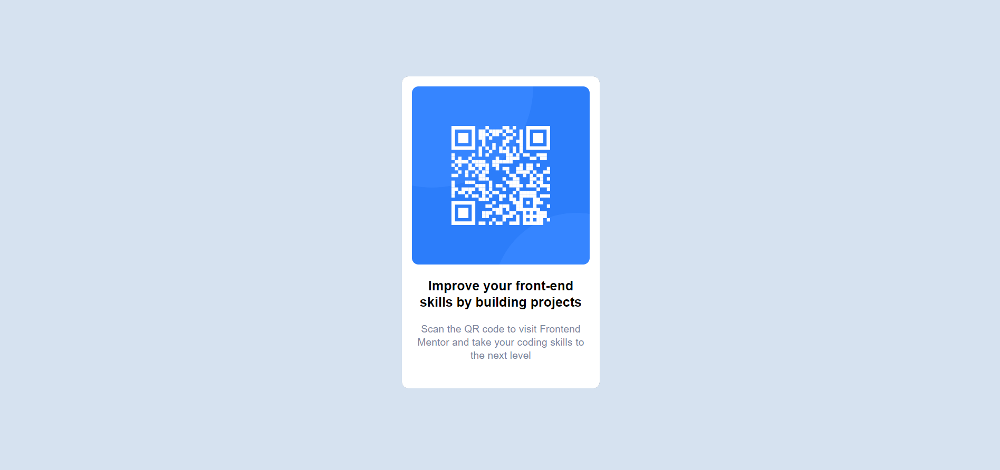

# Frontend Mentor - QR code component solution

This is a solution to the [QR code component challenge on Frontend Mentor](https://www.frontendmentor.io/challenges/qr-code-component-iux_sIO_H). Frontend Mentor challenges help you improve your coding skills by building realistic projects.

<br /> 

## Table of contents

- [Overview](#overview)
- [Screenshot](#screenshot)
  - [Desktop View](#desktop-view)
  - [Mobile View](#mobile-view)
- [Built with](#built-with)
- [What I learned](#what-i-learned)
- [Author](#author)

<br />

## Overview

The result of the project should be a responsive web page that displays a QR code in the center of the page. The QR code should be generated using HTML and CSS only and should be able to adapt to different screen sizes and display correctly on both desktop and mobile devices. The design of the page should be clean, simple and easy to understand, with a clear focus on the QR code. Additionally, the QR code should be functional, meaning that when scanned using a QR code scanner, it should redirect to the desired link or show the desired information.

<br />

## Screenshot

### Desktop View

<p align="center">
 
</p>

### Mobile View

<p align="center">
 
</p>

<br />

## Built with

- Semantic HTML5 markup
- CSS custom properties
- Flexbox
- CSS Grid

**Yep! that's all**

I challenged myself to not use any frameworks :D

<br />

## What I learned

In this project, I learned about how to make a responsive page for QR Code. It is responsive and can be accessed through any device.

It's pretty much simple, this is the card structure

```html
  <div class="card">
    
    <p class="title">Improve your front-end skills by building projects</p>
    <p class="desc">Scan the QR code to visit Frontend Mentor and take your coding skills to the next level</p>
  </div>
```

For the body section, i use display grid and place-items to make the card both horizontally and vertically centered. 

Also for the font style itself, I can't find the match one, so I just follow the style guide for that.

```css
body{
    font-family: 'Outfit', sans-serif;
    background-color: var(--lightgray);
    text-align: center;
    height: 100vh;
    display: grid;
    place-items: center;
}
```

This section is the style for the card

```css
body > .card{
    max-width: 270px;
    height: auto;
    background-color: var(--white);
    border-radius: 10px;
    box-shadow: 0 0 0.5px 0 var(--darkblue);
    padding: 15px;
    display: flex;
    flex-direction: column;
    justify-content: center;
    align-items: center;
}
```

<br />

## Author

- Website - [Patricia's Portofolio Website](https://patriciasky17.github.io/)
- Frontend Mentor - [@patriciasky17](https://www.frontendmentor.io/profile/patriciasky17)
- Instagram - [@patricia.sky17](https://www.instagram.com/patricia.sky17/)

